<div align="center">
  <br />
  
  <br />
  <h2>🎵NAVI : 친구들과 함께 AI 커버곡을 만들어보아요🎤</h2>
<h3>삼성 청년 소프트웨어 아카데미 특화 프로젝트 우수상 수상🥉</h3>

<b>[ SSAFY 10기 특화 PJT ] TEAM F1B4</b>

<br />

</div>

## 목차

1. [**웹 서비스 소개**](#1)
1. [**기술 스택**](#2)
1. [**주요 기능**](#3)
1. [**프로젝트 구성도**](#4)
1. [**서비스 화면**](#5)
1. [**개발 팀 소개**](#6)
1. [**개발 기간 및 일정**](#7)
1. [**디렉터리 구조**](#8)
1. [**산출물**](#9)

<br />

<div id="1"></div>

## ✨ 웹 서비스 소개

NAVI는 사용자의 목소리를 학습한 AI모델로 커버곡을 만들고 공유하는 서비스입니다. <br/>
맞팔로우 관계인 유저들과 함께 원하는 파트를 선택하여, 커버곡을 생성하고 공유할 수 있습니다. <br/>

### [NAVI 바로 가기](https://j10d107.p.ssafy.io/) (서비스 종료)
### [AI 커버곡 결과 미리보기](https://drive.google.com/file/d/1_hhPnYIfVT5lF-aHPZhZHSoCSAxbjOTm/view?usp=sharing)

<br />

<div id="2"></div>

## 🛠️ 기술 스택

### Frontend

<a href="https://www.w3.org/">
  
</a>
<a href="https://www.w3schools.com/css/">
  
</a>
<a href="https://reactjs.org/">
  
</a>
<a href="https://www.typescriptlang.org/">
  
</a>
<a href="https://www.tailwindcss.com/">
  
</a>
<a href="https://daisyui.com/">
  
</a>
<a href="https://vitejs.dev/">
  
</a>
<a href="https://axios-http.com/kr/docs/intro">
  
</a>
<a href="https://zustand-demo.pmnd.rs/">
  
</a>

<br />

### Backend

<a href="https://www.java.com/">
  
</a>
<a href="https://spring.io/projects/spring-boot">
  
</a>
<a href="https://hibernate.org/">
  
</a>
<a href="https://spring.io/projects/spring-security">
  
</a>
<a href="https://jwt.io/">
  
</a>
<a href="https://oauth.net/2/">
  
</a>
<a href="https://www.mysql.com/">
  
</a>

<br />

### AI & Video

<a href="https://github.com/RVC-Project/Retrieval-based-Voice-Conversion-WebUI/tree/main">
  
</a>
<a href="https://www.python.org/">
  
</a>
<a href="https://fastapi.tiangolo.com/ko/">
  
</a>
<a href="https://docs.celeryq.dev/en/stable/">
  
</a>
<a href="https://pytorch.org/">
  
</a>
<a href="https://pillow.readthedocs.io/en/stable/">
  
</a>
<a href="https://opencv.org/">
  
</a>

<br />

### DevOps

<a href="https://aws.amazon.com/">
  
</a>
<a href="https://www.docker.com/">
  
</a>
<a href="https://www.nginx.com/">
  
</a>
<a href="https://www.jenkins.io/">
  
</a>

<br />

### Tools

<a href="https://about.gitlab.com/">
  
</a>
<a href="https://www.atlassian.com/software/jira">
  
</a>
<a href="https://www.notion.so/">
  
</a>
<a href="https://mattermost.com/">
  
</a>
<a href="https://www.figma.com/">
  
</a>
<a href="https://discord.com/">
  
</a>

<br />
<br />

<div id="3"></div>

## 💡 주요 기능

<table style="word-break: keep-all;">
<tr ><th style="text-align:center;">기능</th><th>내용</th></tr>
<tr>
  <td style="text-align:center;">AI 커버곡 생성</td>
  <td>사용자는 노래를 직접 부르지 않고도 AI를 이용하여 자신의 목소리로 커버곡을 생성할 수 있습니다.</td>
</tr>

<tr>
  <td style="text-align:center;">그룹곡 커버 매칭</td>
  <td>매칭 시스템을 통해 파트를 맡을 사람들을 찾아서 그룹 커버곡을 생성할 수 있습니다.</td>
</tr>

<tr>
  <td style="text-align:center;">나만의 노래방</td>
  <td>서비스에서 제공되는 가사를 보면서 자신의 노래를 녹음하고 저장할 수 있습니다.</td>
</tr>

<tr>
  <td style="text-align:center;">커뮤니티</td>
  <td>AI 커버곡이나 직접 부른 노래를 공유하고, 다른 사용자의 게시물에 댓글을 달거나 팔로우를 통해 커뮤니티를 형성합니다.</td>
</tr>


</table>

<br/>

<div id="4"></div>

## 📂 프로젝트 구성도


<br/>
<br/>


<br/>

<div id="5"></div>

## 🖥️ 서비스 화면

### 로그인
<table style="border: 2px; text-align:center;">
  <tr style="text-align:center;">
    <td> 로그인 </td>
  </tr>
  <tr>
    <td>
     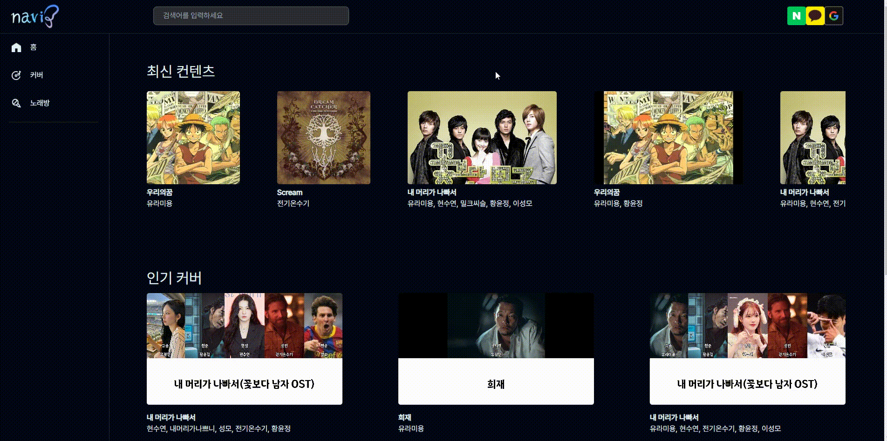
    </td>
  </tr>
</table>

<br/>

### 노래방
<table style="border: 2px; text-align:center;">
  <tr style="text-align:center;">
    <td> 노래 선택 </td>
    <td> 녹음 </td>
  </tr>
  <tr>
    <td>
      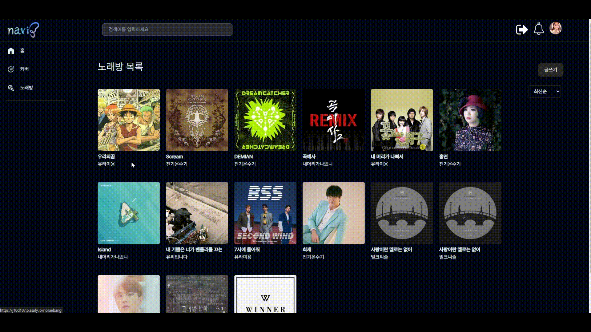
    </td>
    <td>
      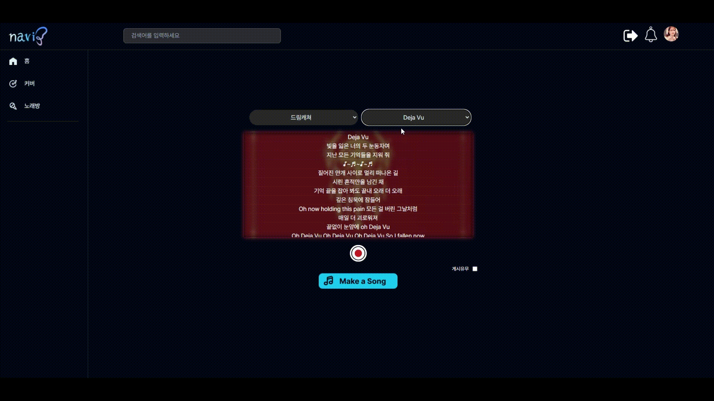
    </td>
  </tr>
</table>
<table style="border: 2px; text-align:center;">
  <tr style="text-align:center;">
    <td> 재생 </td>
    <td> 게시글 작성 </td>
  </tr>
  <tr>
    <td>
      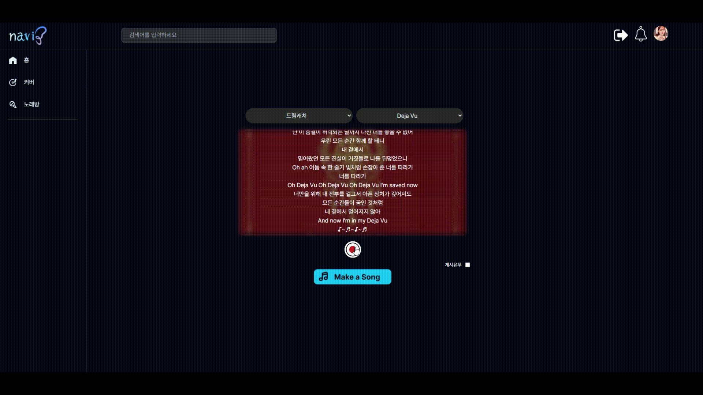
    </td>
    <td>
      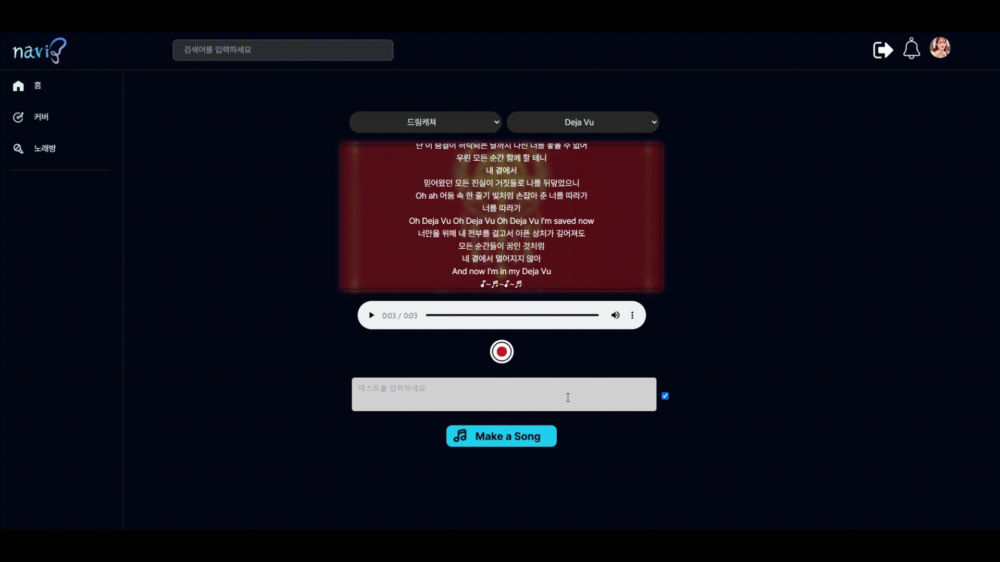
    </td>
  </tr>
</table>

<br/>

### AI 커버곡
<table style="border: 2px; text-align:center;">
  <tr style="text-align:center;">
    <td> 글쓰기 </td>
    <td> 노래 선택 </td>
  </tr>
  <tr>
    <td>
      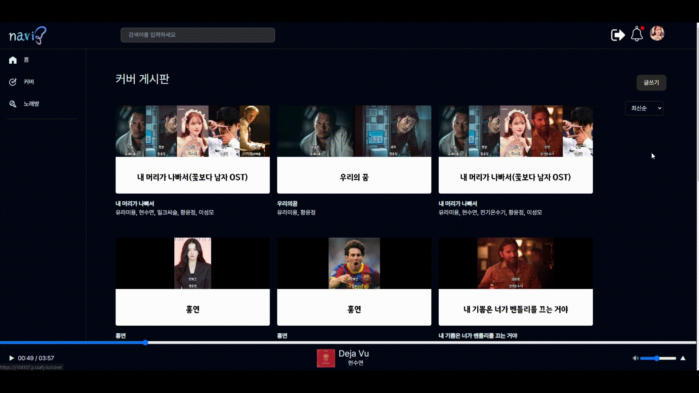
    </td>
    <td>
      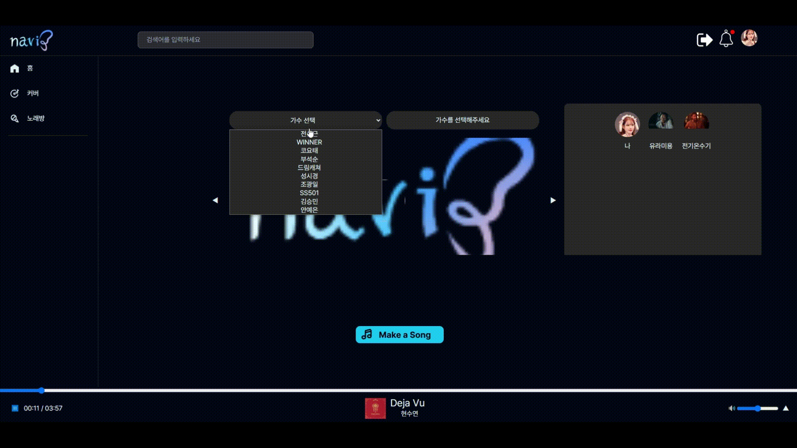
    </td>
  </tr>
</table>
<table style="border: 2px; text-align:center;">
  <tr style="text-align:center;">
    <td> 커버생성 후 매칭 </td>
    <td> 매칭 완료 알림 </td>
  </tr>
  <tr>
    <td>
      
    </td>
    <td>
      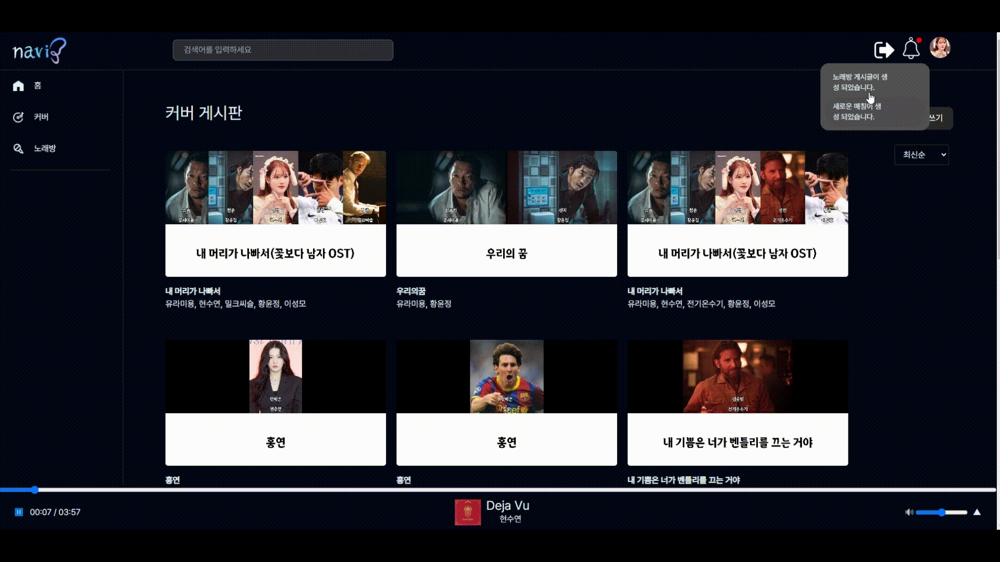
    </td>
  </tr>
</table>
<table style="border: 2px; text-align:center;">
  <tr style="text-align:center;">
    <td> 커버 디테일 </td>
    <td> 커버곡 재생 </td>
  </tr>
  <tr>
    <td>
      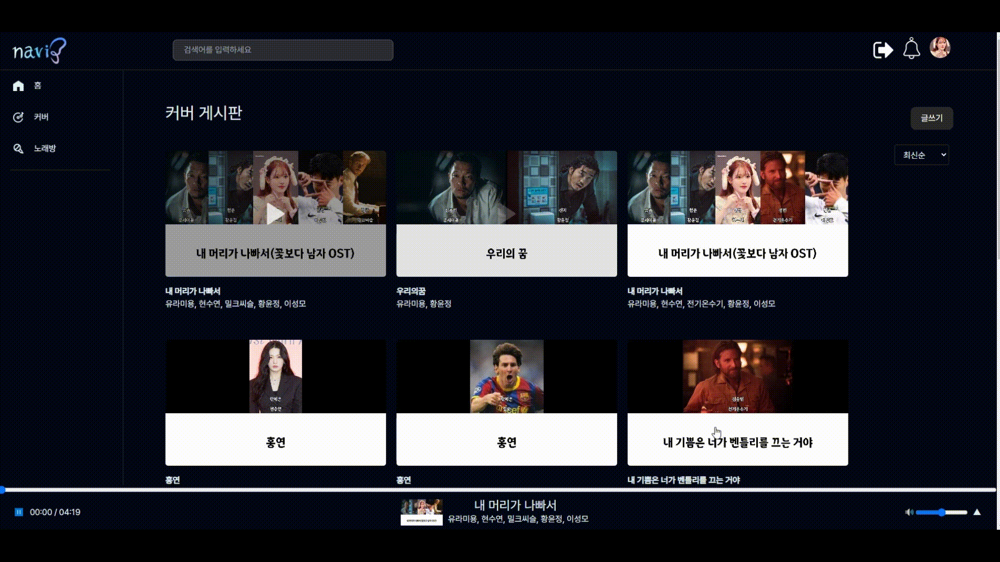
    </td>
    <td>
      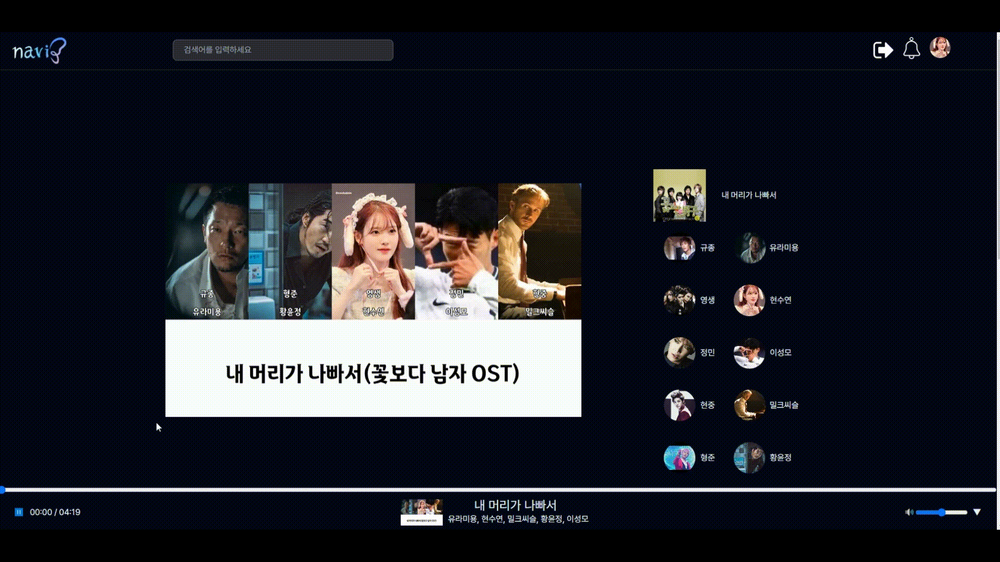
    </td>
  </tr>
</table>

<br/>

### 유저 피드
<table style="border: 2px; text-align:center;">
  <tr style="text-align:center;">
    <td> 언팔로우 </td>
    <td> 팔로우 </td>
    <td> 마이페이지 </td>
  </tr>
  <tr>
    <td>
      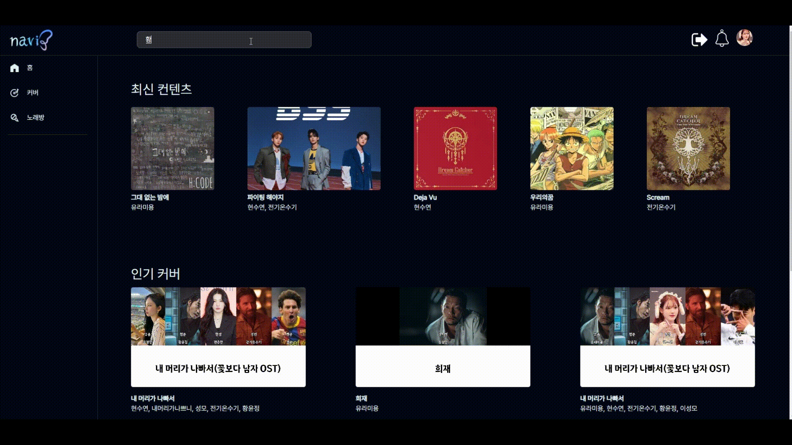
    </td>
    <td>
      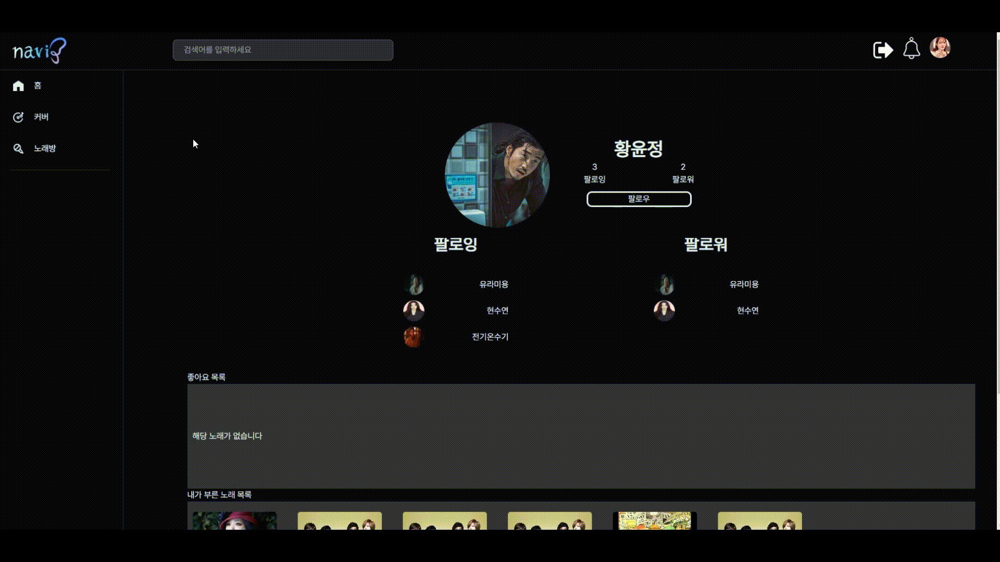
    </td>
    <td>
      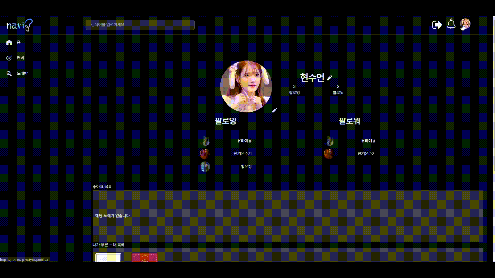
    </td>
  </tr>
</table>

<br/>

<div id="6"></div>

## 👨🏻‍💻 개발 팀 소개

<table>
<tr>
<td align="center">AI / 팀장</td>
<td align="center">FE</td>
<td align="center">BE</td>
<td align="center">BE</td>
<td align="center">BE / INFRA</td>
</tr>
  <tr>
    <td align="center" width="160px">
      <a href="https://github.com/yellowchili" target="_blank">
        
      </a>
    </td>
    <td align="center" width="160px">
      <a href="https://github.com/LEESEOM" target="_blank">
        
      </a>
    </td>
    <td align="center" width="160px">
      <a href="https://github.com/ggty97" target="_blank">
        
      </a>
    </td>
    <td align="center" width="160px">
      <a href="https://github.com/suyeon-hyeon" target="_blank">
        
      </a>
    </td>
    <td align="center" width="160px">
      <a href="https://github.com/hyyoom" target="_blank">
        
      </a>
    </td>
  </tr>
  <tr>
    <td align="center">
      <a href="https://github.com/yellowchili" target="_blank">
       황윤정
      </a>
    </td>
    <td align="center">
      <a href="https://github.com/LEESEOM" target="_blank">
       이성모
      </a>
    </td>
    <td align="center">
      <a href="https://github.com/ggty97" target="_blank">
       김익환
      </a>
    </td>
    <td align="center">
      <a href="https://github.com/suyeon-hyeon" target="_blank">
       현수연
      </a>
    </td>
    <td align="center">
      <a href="https://github.com/hyyoom" target="_blank">
       유형민
      </a>
    </td>
  </tr>
</table>

<br />

<div id="7"></div>

## 🗓️ 개발 기간 및 일정

24.02.19. ~ 24.04.04

<br />

<div id="8"></div>

## 📂 디렉터리 구조

### Front-end

```
FE
├───app
├───entities
│   ├───coverDetail
│   │   └───api
│   ├───coverList
│   │   └───api
│   ├───hotCoverList
│   │   └───api
│   ├───hotNoraebangList
│   │   └───api
│   ├───newContentsList
│   │   └───api
│   ├───noraebangDetail
│   │   └───api
│   ├───noraebangList
│   │   └───api
│   ├───profile
│   │   └───api
│   └───singerList
├───features
│   ├───cover
│   ├───follow
│   ├───like
│   ├───logout
│   │   ├───model
│   │   └───ui
│   │       └───LogoutBtn
│   ├───modInfo
│   ├───notification
│   │   └───ui
│   │       └───Noti
│   ├───play
│   ├───search
│   ├───song
│   ├───sortby
│   └───videoPlay
├───pages
│   ├───coverBoard
│   │   └───ui
│   │       ├───CoverList
│   │       └───Page
│   ├───coverDetail
│   │   └───ui
│   │       ├───CoverDetail
│   │       ├───Info
│   │       └───Page
│   ├───coverPost
│   │   └───ui
│   │       └───Page
│   ├───home
│   │   └───ui
│   │       ├───HotCoverList
│   │       ├───HotNoraebangList
│   │       ├───NewContentsList
│   │       └───Page
│   ├───noraebangBoard
│   │   └───ui
│   │       ├───NoraebangList
│   │       └───Page
│   ├───noraebangDetail
│   │   └───ui
│   │       ├───Info
│   │       ├───NoraebangDetail
│   │       └───Page
│   ├───noraebangPost
│   │   └───ui
│   │       └───Page
│   ├───profile
│   │   └───ui
│   │       ├───Info
│   │       ├───LikeList
│   │       ├───MySongList
│   │       └───Page
│   ├───searchResults
│   │   └───ui
│   │       └───Page
│   └───searchResultsDetail
│       └───ui
│           └───Page
├───shared
│   ├───api
│   ├───store
│   │   └───userStore
│   ├───ui
│   │   ├───Alarm
│   │   ├───Btn
│   │   ├───Card
│   │   ├───icon
│   │   ├───modal
│   │   └───UserImage
│   └───url
└───widgets
    ├───LayoutHeader
    │   └───ui
    │       ├───Alarm
    │       ├───LayoutHeader
    │       ├───LayoutHeaderUserImage
    │       ├───Login
    │       ├───Logo
    │       └───Searchbar
    ├───LayoutSidebar
    │   └───ui
    │       └───LayoutSidebar
    ├───Playbar
    └───Reviews
        └───ui
            └───Reviews
```

### Back-end

```
BE
├───java
│   └───ssafy
│       └───navi
│           ├───config
│           ├───controller
│           ├───dto
│           │   ├───cover
│           │   ├───noraebang
│           │   ├───song
│           │   ├───user
│           │   └───util
│           ├───entity
│           │   ├───cover
│           │   ├───noraebang
│           │   ├───song
│           │   ├───user
│           │   └───util
│           ├───jwt
│           ├───oauth2
│           ├───repository
│           └───service
└───resources
```

<br />

<div id="9"></div>

## 📃 산출물

### [1. 기능 명세서](https://talented-gondola-4cb.notion.site/1f3c15620e504bfbb3b66e84cb911376?v=3b7adc0363ec429a8c424971d753b7db&pvs=4)

### [2. 화면 설계서](https://www.figma.com/design/Dyoc7LnFDJZg4n74iPXYkn/final-navi?t=5FlQmNNuwLh4LPzA-0)

### [3. API 명세서](https://talented-gondola-4cb.notion.site/7456a7834c49402780e83937bf78bcdc?v=4ede02e71915410d8fef9c867b75af2f)

### [4. ERD](https://www.erdcloud.com/d/oCnWwuxFBzes84R3m)
